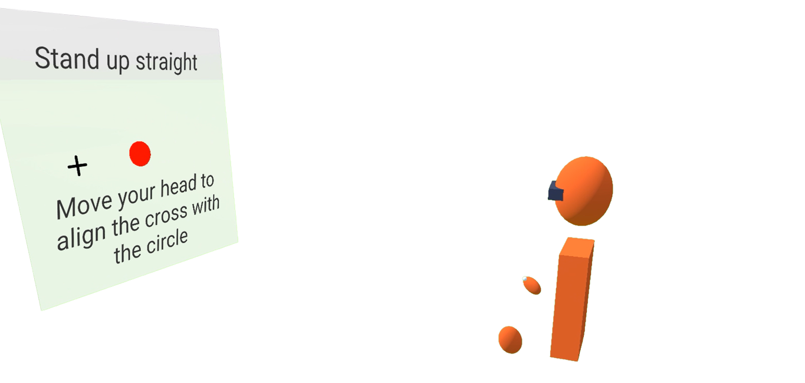
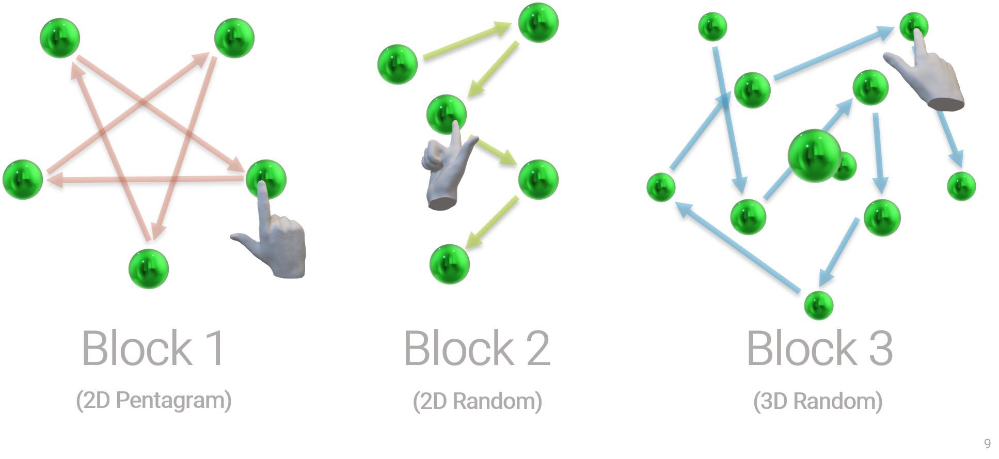
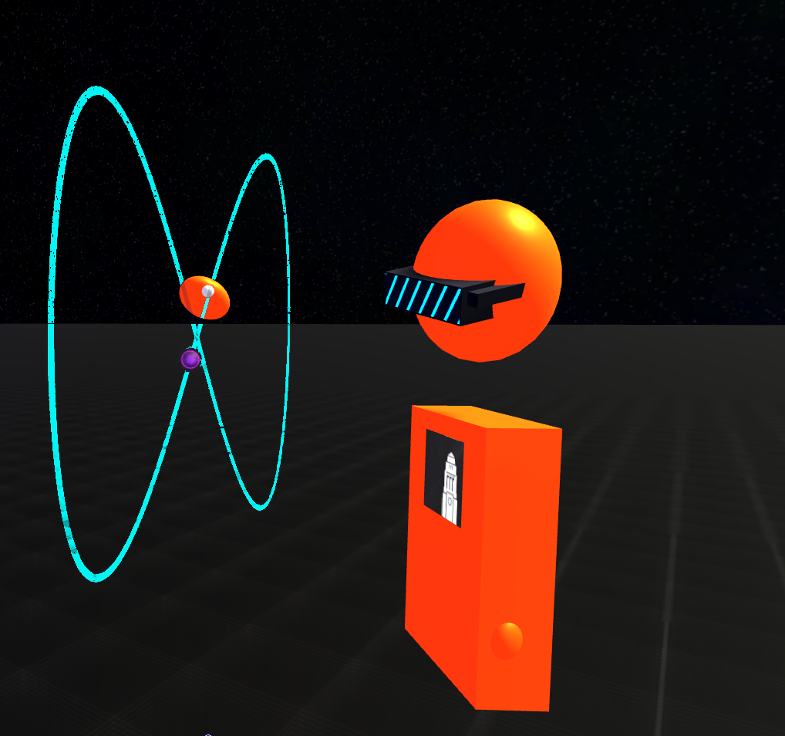

 # VRCAT (VR Cognitive Assessment Tool)

  

A tool to easily run and manage VR sensorimotor experiments, powered by Unity. Designed and developed over two consecutive summers at the [Immersive Cognition Laboratory](https://github.com/immersivecognition) (ICON) in Leeds School of Psychology.

> Built in Unity v.2020.2.1f1

## Background 🌄

Sensorimotor learning is a crucial process in the development of every human being. Many children who experience impairments to fundamental movement skills (FMS) have poorer academic and social outcomes, which may persist into adulthood. To better identify and support these children, [ICON](https://github.com/immersivecognition) developed the original [Clinical Kinematic Assessment Tool](https://pubmed.ncbi.nlm.nih.gov/19646475/) (CKAT). Originally designed for tablet computers, it proved really useful in assessing the FMS of entire school cohorts in tasks such as aiming, steering, and object tracking.

Inspired by CKAT, VRCAT was commissioned by  [ICON](https://github.com/immersivecognition) to bring the scalable assessment of FMS into three-dimensions. Allowing for 3D positional and rotational tracking, VRCAT can record movement data for the head and hands with all 6 degrees of freedom. Powered by the [Unity Experiment Framework](https://github.com/immersivecognition/unity-experiment-framework), it's flexible structure facilitates the collection of data across multiple experiments, such as the Aiming, Tracking and Interceptive Timing tasks that were developed and integrated into the battery. 

## Startup Panel 🖥️

The UI shown below enables a researcher to retrieve/create a participant list (stored as a `.csv` file), select or register a new participant with a unique ID, and finally to tick the experiments that they want to run. Components in the UI can be customised by editing the relative `GameObject` components, making it easy to add new tasks to the battery.

  

Settings profiles stored as `.json` files can be loaded and tweaked with just a few clicks. Task customization is paramount, since there isn't a "one-size-fits-all" way of conducting FMS experiments. The possibility to alter parameters such as the number of experimental trials, the appearance of some stimuli or the speed of a target without having to change any code makes it trivial for researchers to quickly adapt their experiments to their participant's needs.

The scale of the "workspace" where tasks take place is also automatically adjusted at startup thanks to the head alignment system shown below.

  
  
## The Tasks 📋
Once the participant data points have been input, the settings have been loaded and the experiments have been selected, the `SceneLoader` C# class triggers the scene for each task the experimenter wishes to run in sequence. 

I developed two of the three tasks that are featured in the battery at the time of writing, assessing two of the FMS that the original CKAT was designed to study: _Aiming_ and _Tracking_. A third task assessing _Interceptive Timing_ was developed by [Jack Brookes](https://github.com/jackbrookes) and integrated into VRCAT by me.

### Aiming 🎯 

The participant is challenged to reach for a glowing orb as quickly and accurately as possible. The target is repositioned after each trial, either to a new location on the same plane or to another point in the 3D space (depending on how the experiment is configured).

The `PointsGenerator` script was written to enable the experimenter to shuffle the target coordinates, so as to make them unpredictable but not completely random, in order to test each participant under equitable conditions.

  

At the time of writing, this task is split into 3 experimental blocks:

- **Block 1**:  The target moves in a "predictable" pentagram pattern
- **Block 2**: The target moves in a randomized 2D pattern within a set radius
- **Block 3**: The target moves in a randomized 3D pattern within a set radius

  

### Tracking 📐

The original CKAT featured a _Tracking_ task where the participant had to closely follow a target moving in a "figure-8" shape using a stylus. In the VRCAT version, the same kind of positional accuracy assessment is takes place in 3D, making it a more realistic challenge.

Trajectories are generated from the following set of equations:

  

The path's complexity complexity can be easily tweaked by changing the equation parameters from the relative settings `.json` file.

Settings Profile             |  VR Task
:-------------------------:|:-------------------------:
 | 

Computations are performed online thanks to the use of `Coroutines`: the mean distance between the participant's hand and the target is computed at the end of each trial and results are updated accordingly.

### Interceptive Timing 🎾
 
This task examines the interceptive timing ability of children and adults. Crucially, VR allows the task to be made 3D - which means we can more reliably discern spatial and temporal errors separately. The gamification of the interceptive timing task means children enjoy taking part in the studies.

  

Designed and developed by [Jack Brookes](https://github.com/jackbrookes) at [ICON](https://github.com/immersivecognition).

## UXF Integration 🧠

Developed by [Jack Brookes](https://github.com/jackbrookes) at the *University of Leeds*, the  [Unity Experiment Framework](https://github.com/immersivecognition/unity-experiment-framework) (UXF)
is a package for developing gamified experiments in Unity. Its integration into VRCAT permitted to organize tasks into `Sessions` composed of experimental `Blocks` split into several `Trials`. 

The figure below shows the events that are run sequentially throughout a UXF `Session`.

  

## Data Output 📈
Continuous and discrete data is collected throughout each session thanks to the threaded `.csv` handler system within UXF. For example, session results for an instance of the _Tracking_ task  will be presented as shown below:

  

